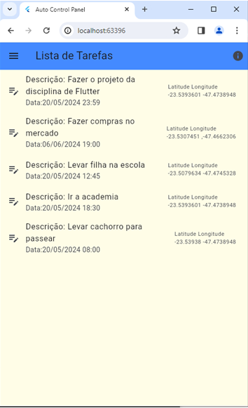
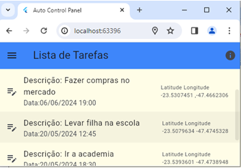
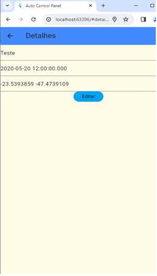
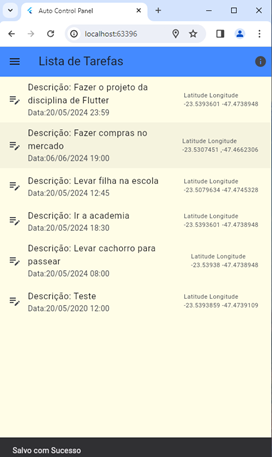
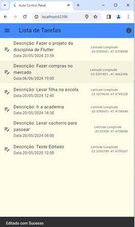
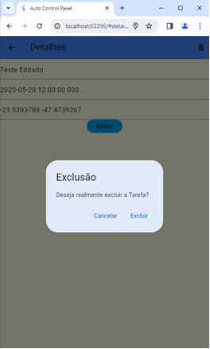
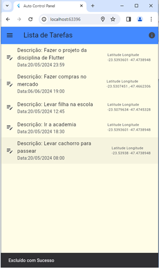

#Aluno:Bruno Rodrigues dos Santos Silva

Disciplina: Desenvolvimento Mobile com Flutter [24E2_2]

#Prints

TELA HOME - LISTA AS TAREFAS

LISTA DE TAREFAS RESPONSIVA

EDITAR TAREFA

TAREFA SALVA

EDITAR TAREFA

TAREFA EDITADA

EXCLUIR TAREFA

TAREFA EXCLUIDA

